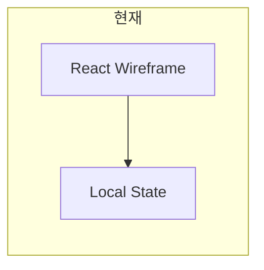
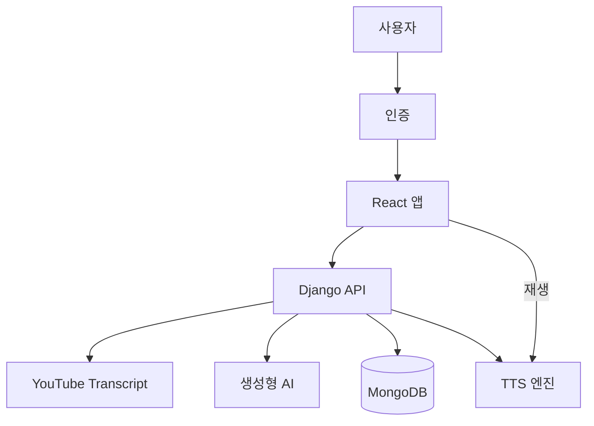

# AudioFit 구현 계획

## 1. 문서 목적

이 문서는 현재 React 프론트엔드 와이어프레임을 Django 백엔드와 통합하여 실제 AudioFit 서비스로 전환하기 위한 구현 계획입니다. 서비스는 유튜브 자막 기반 AI 루틴 생성, 음성 코칭 재생, 사용자 관리, 보관함 기능을 핵심으로 합니다.

## 2. 현재 상태 (As-Is)

| 영역 | 상태 |
|------|------|
| 프론트 | React + Vite, `src/components/` 기반 5개 화면 와이어프레임, 목 데이터 사용 |
| 데이터 | `src/components/constants.js`에 하드코딩된 `INITIAL_ROUTINES`, `EXERCISES` 등 |
| 백엔드 | 없음 (API, 인증, DB, TTS, AI 파이프라인 미구현) |
| 브랜치 | `dev` 기준 개발 중 |

## 3. 목표 서비스 (To-Be)

AudioFit는 사용자가 유튜브 홈트 영상을 직접 보지 않고, 광고와 잡담을 제거한 음성 코칭으로 루틴을 수행하도록 돕는 서비스입니다.

## 4. 권장 기술 스택

현재 사용자 요청은 Django 백엔드를 명시하고 있습니다. 이에 다음 스택을 권장합니다.

| 계층 | 권장 기술 | 이유 |
|------|-----------|------|
| 프론트 | React + Vite + React Router + TanStack Query | 기존 와이어프레임 재사용, API 연동 및 상태 관리에 유리 |
| 인증 | Firebase Authentication | 직접 비밀번호 저장 부담 감소, 안전한 인증 제공 |
| DB | MongoDB Atlas | 루틴·클립·자막·세션 데이터를 문서 형태로 저장하기 쉬움 |
| API | Django REST Framework | Python 기반 AI/자막 처리, 관리 기능, REST API 구현에 적합 |
| 백그라운드 작업 | Celery + Redis | 비동기 루틴 생성, 긴 처리 작업 체계화 |
| 자막 수집 | youtube-transcript-api (Python) | 서버에서만 호출, API 키 및 CORS 보호 |
| AI | OpenAI API / Gemini | 자연어 요약, 동작 분할, 쉬운 설명 생성 |
| TTS | 1단계: Web Speech API, 2단계: 서버 TTS | MVP는 브라우저 TTS로 빠르게 검증, 향후 서버 TTS로 음질 개선 |

> 대안: Python 기반 백엔드가 필요하므로 Firebase Functions 대신 Django + MongoDB 기반 설계가 운영 및 디버깅에 더 적합합니다.

## 5. 와이어프레임 ↔ 기능 매핑

| 화면 | 파일 | 구현 기능 |
|------|------|----------|
| 스플래시 | `src/components/SplashScreen.jsx` | 초기 로딩, 세션 복원 흐름, 스킵 옵션 (후순위) |
| 홈 | `src/components/screens/HomeScreen.jsx` | 최근/추천 루틴 조회, 루틴 실행 진입 |
| 새 루틴 | `src/components/screens/NewRoutineScreen.jsx` | 유튜브 URL 입력, 클립 추출, 구간 선택, 번역 토글, 이름 지정, 생성 요청 |
| 플레이어 | `src/components/screens/PlayerScreen.jsx` | 루틴 재생, TTS 안내, 타이머, 배속 제어 |
| 보관함 | `src/components/screens/LibraryScreen.jsx` | 루틴 목록, 검색, 삭제, 편집 진입 |
| 마이페이지 | `src/components/screens/MyPageScreen.jsx` | 통계, 설정, 체력 수준 저장 |
| 로그인/회원가입 | 추가 예정 | Firebase Auth 기반 인증 UI |
| 튜토리얼 | 추가 예정 | 전체 기능 완성 후 사용자 온보딩 |

## 6. 구현 단계 (Phase)

### Phase 0 — 기반 구성

- `backend/`에 Django 프로젝트 생성
- Django REST Framework, CORS, 환경 변수 템플릿 구성
- MongoDB 연결 준비 (PyMongo 기반 Repository 패턴 권장)
- API 버전 네임스페이스 `/api/v1/` 적용
- 프론트: `src/api/`, Firebase SDK, 인증 상태 관리 구조 준비
- 공통 데이터 모델 정의: Routine, Clip, Exercise, JobStatus

### Phase 1 — 로그인/인증

- Firebase Authentication 적용
- Django에서 Firebase ID Token 검증 미들웨어 구현
- Django 요청에 `request.user_id` 삽입
- MongoDB `users` 컬렉션 설계
  - `firebase_uid`, `display_name`, `fitness_level`, `settings`, `created_at`
- 비밀번호는 Firebase에서만 관리

### Phase 2 — 유튜브 URL 및 자막 수집

- `POST /api/v1/clips/preview` : URL 검증, video_id 추출
- `POST /api/v1/clips/transcript` : `youtube-transcript-api`로 자막 수집
- MongoDB `video_clips` 문서 저장
- 프론트에서 `NewRoutineScreen`에 메타·자막 로딩 UI 추가

### Phase 3 — 구간 선택

- 클립별 `start_sec`, `end_sec` 정보 저장
- `GET /api/v1/clips/{id}/duration` 또는 preview 응답에 길이 포함
- 다중 클립 지원: 순서(`order`) 저장

### Phase 4 — 번역 모드 및 루틴 이름

- `translate_mode` 플래그 저장
- `routine_name` 유효성 검사: 길이, 중복
- UI에 토글 및 이름 입력 필드 연동

### Phase 5 — 루틴 생성 Job

- `POST /api/v1/routines` : 상태 `pending`으로 Job 생성
- Celery 작업 흐름
  1. 클립 자막에서 선택 구간 필터링
  2. LLM으로 불필요 문장 제거 및 코칭 문장 생성
  3. LLM으로 동작 단위 분할과 지침 생성
  4. `translate_mode`인 경우 쉬운 설명 추가
  5. MongoDB에 `routines`, `routine_clips`, `exercises` 저장
  6. `ready` 또는 `failed` 상태, 오류 메시지 저장
- `GET /api/v1/routines/{id}/status` : 프론트 폴링
- 실패 시 재시도 또는 부분 저장 전략 수립

### Phase 6 — 보관함 및 홈

- CRUD API 구현: `GET`, `DELETE`, `PATCH` `/api/v1/routines`
- Library 검색 기능: 이름 검색
- 홈에 최근 재생 기록 표시 가능

### Phase 7 — 플레이어 및 TTS

- `GET /api/v1/routines/{id}/play` : exercises + 루틴 메타 반환
- 플레이어 상태 관리: `idle → coaching → rest → next`
- MVP TTS: 브라우저 Web Speech API 사용
- 타이머 동작: `exercise.duration_sec` 기반
- `POST /api/v1/sessions` : 운동 완료 기록 저장

### Phase 8 — 튜토리얼

- `users.tutorial_completed` 플래그 저장
- 로그인 후 3~5단계 온보딩 오버레이
- Phase 1~7 안정화 후 구현

### Phase 9 — 운영 및 품질

- Rate limiting: 자막/LLM 호출 보호
- 비용/지연 모니터링: AI, TTS 호출
- E2E 테스트: 루틴 생성 → 재생 시나리오 검증

## 7. DB 스키마 초안

### routines
- `_id`
- `user_id`
- `name`
- `translate_mode`
- `status`
- `total_duration_sec`
- `created_at`

### routine_clips
- `routine_id`
- `clip_id`
- `start_sec`
- `end_sec`
- `order`

### exercises
- `routine_id`
- `order`
- `name`
- `instruction`
- `instruction_easy`
- `duration_sec`
- `coaching_text`

### video_clips
- `user_id`
- `youtube_url`
- `video_id`
- `title`
- `duration_sec`
- `transcript_raw`

### users
- `firebase_uid`
- `display_name`
- `fitness_level`
- `settings`
- `created_at`

## 8. 주요 API 엔드포인트

| Method | Path | 용도 |
|--------|------|------|
| POST | `/api/v1/auth/verify` | Firebase 토큰 검증 |
| POST | `/api/v1/clips/preview` | 유튜브 URL 메타 정보 확인 |
| POST | `/api/v1/clips/transcript` | 자막 수집 및 저장 |
| POST | `/api/v1/routines` | 루틴 생성 요청 |
| GET | `/api/v1/routines/{id}/status` | 생성 진행 상태 조회 |
| GET | `/api/v1/routines` | 루틴 목록 조회 |
| GET | `/api/v1/routines/{id}` | 개별 루틴 상세 조회 |
| DELETE | `/api/v1/routines/{id}` | 루틴 삭제 |
| PATCH | `/api/v1/users/me` | 사용자 설정 수정 |

## 9. 프론트 리팩터링 방향

- `AudioFitWireframe.jsx`를 분리하여 `AuthProvider`, `useRoutines`, `usePlayer` 등 훅 기반 구조로 이동
- 목 데이터 제거 후 API 훅 기반 교체
- 로그인 전용 화면 분리, 인증 이후 Tab 화면 표시
- 환경 변수로 `VITE_API_BASE_URL`, `VITE_FIREBASE_API_KEY` 등 관리
- `NewRoutineScreen`과 `PlayerScreen`에 실제 비즈니스 로직 연결

## 10. 리스크 및 대응

| 리스크 | 대응 |
|--------|------|
| 유튜브 자막 없음 | 사용자 안내, 수동 구간 입력 폴백 |
| LLM 비용/지연 | Celery 비동기 처리, 캐시, 토큰 상한 설정 |
| 자막 API ToS | 서버 측에서만 호출, 공개 자막만 사용 |
| MongoDB + Django ORM | PyMongo/Repository 패턴으로 단순화 |
| TTS 품질 | Web Speech API로 MVP 개발, 이후 서버 TTS 전환 |

## 11. MVP 우선순위

### MVP (4~6주 목표)
- Phase 0, 1, 2, 3, 5(단일 클립·단순 LLM), 6, 7(Web Speech)

### Full
- 다중 클립, 서버 기반 TTS, 튜토리얼, 추천 시스템, 오프라인 캐시

## 12. 추가 문서화 항목

- 전체 디렉터리 구조 제안
- 환경 변수 목록
- 팀 역할 분담 (FE/BE/AI)
- 기능 구현 마일스톤과 요구 대응 매핑

---

`docs/IMPLEMENTATION_PLAN.md`는 위 설계를 바탕으로 실제 개발 로드맵 및 문서화 기준이 됩니다.
