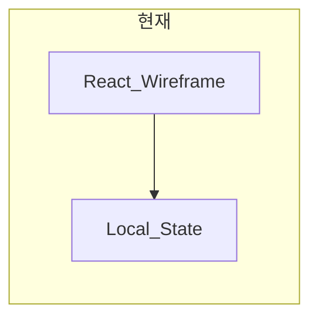
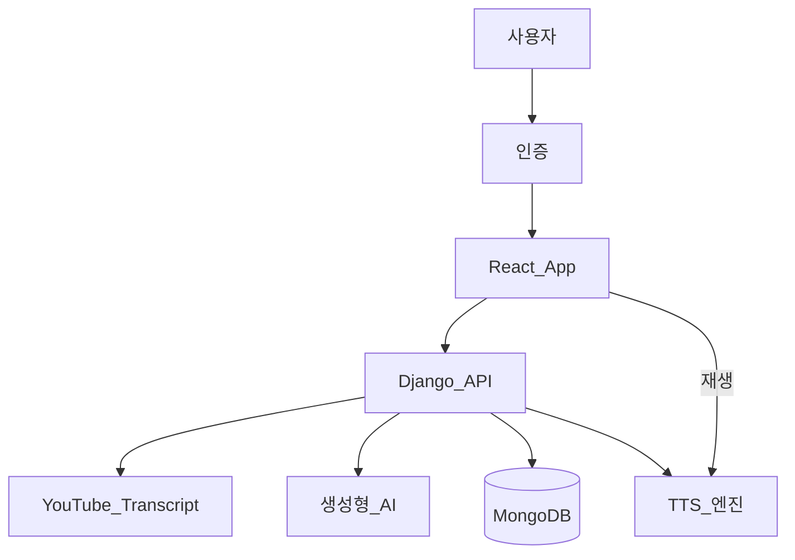

# AudioFit 기능 구현 계획 (문서화)

## 산출물

승인 후 [`docs/IMPLEMENTATION_PLAN.md`](docs/IMPLEMENTATION_PLAN.md)에 아래 내용을 **한국어**로 저장합니다. (기존 [`docs/BRANCHING.md`](docs/BRANCHING.md)와 함께 관리)

## 현재 상태 (As-Is)

| 영역 | 상태 |
|------|------|
| 프론트 | React 19 + Vite, [`src/components/`](src/components/) 와이어프레임 5화면 + 스플래시 |
| 데이터 | [`INITIAL_ROUTINES`](src/components/constants.js), [`EXERCISES`](src/components/constants.js) 등 **하드코딩 목 데이터** |
| 백엔드 | **없음** (API·인증·DB·TTS·AI 파이프라인 미구현) |
| 브랜치 | `dev`에서 개발 ([`docs/BRANCHING.md`](docs/BRANCHING.md)) |



## 목표 서비스 (To-Be)

**핵심 가치**: 유튜브 홈트 영상을 보지 않고, 광고·잡담 없이 **음성 코칭만**으로 루틴 수행.



## 권장 기술 스택 (제안)

사용자 제안(Django, youtube-transcript-api, Firebase/MongoDB)을 반영하되, **비밀번호는 직접 MongoDB에 저장하지 않는** 구성을 권장합니다.

| 계층 | 권장 | 이유 |
|------|------|------|
| 프론트 | 기존 React + React Router + TanStack Query | 와이어프레임 재사용, API 연동·로딩·폴링에 유리 |
| 인증 | **Firebase Authentication** (이메일/소셜) | ID/PW 해시·토큰 관리 부담 감소 |
| 앱 데이터 | **MongoDB Atlas** | 루틴·자막·동작 단위 문서 구조에 적합 |
| API | **Django REST Framework** | transcript 수집·긴 작업·관리자 도구 |
| 비동기 작업 | **Celery + Redis** | 루틴 생성(8단계) 백그라운드 처리 |
| 자막 | `youtube-transcript-api` (Python) | 백엔드에서만 호출 (API 키·CORS 보호) |
| AI | OpenAI API / Gemini 등 (환경변수) | 구간 추출·문장 다듬기·초보자 번역·동작 분할 |
| TTS | 1단계: **브라우저 Web Speech API** (MVP) → 2단계: 서버 TTS(Google Cloud TTS 등) | MVP 빠른 검증 후 음질·오프라인 재생 개선 |

> 대안: 단일 스택을 원하면 Firebase Auth + Firestore + Cloud Functions도 가능하나, Python transcript/배치 작업에는 Django가 운영·디버깅이 수월합니다.

## 와이어프레임 ↔ 기능 매핑

| 화면 | 파일 | 구현할 실제 기능 |
|------|------|------------------|
| 스플래시 | [`SplashScreen.jsx`](src/components/SplashScreen.jsx) | 유지, 세션 복원 시 스킵 옵션(후순위) |
| 홈 | [`HomeScreen.jsx`](src/components/screens/HomeScreen.jsx) | 최근/추천 루틴 API, 시작 → Player |
| 새 루틴 | [`NewRoutineScreen.jsx`](src/components/screens/NewRoutineScreen.jsx) | URL 입력·클립 목록·구간·번역 토글·이름·저장 → 생성 Job |
| 플레이어 | [`PlayerScreen.jsx`](src/components/screens/PlayerScreen.jsx) | DB 동작 목록·타이머·TTS 재생·배속 |
| 보관함 | [`LibraryScreen.jsx`](src/components/screens/LibraryScreen.jsx) | CRUD·검색·삭제·편집 진입 |
| 마이페이지 | [`MyPageScreen.jsx`](src/components/screens/MyPageScreen.jsx) | 통계·설정·체력 수준 저장 |
| (신규) 로그인/회원가입 | 추가 예정 | Firebase Auth UI |
| 튜토리얼 | 추가 예정 | **전체 기능 완료 후** (사용자 의견 반영) |

## 사용자 플로우 → 구현 단계 (9단계 반영)

### Phase 0 — 기반 (1~2주)
- `backend/` Django 프로젝트, DRF, CORS, `.env` 템플릿
- MongoDB 연결 (`djongo` 또는 **PyMongo + 직접 Repository** — Django ORM 호환성 이슈 시 후자 권장)
- API 버전 prefix `/api/v1/`
- 프론트: `src/api/` 클라이언트, Firebase SDK, Auth Guard
- 공통 타입: Routine, Clip, Exercise, JobStatus

### Phase 1 — 로그인 (요구 1)
- Firebase Auth: 회원가입·로그인·로그아웃·토큰 갱신
- Django: Firebase ID Token 검증 미들웨어 → `request.user_id`
- MongoDB `users` 컬렉션: `firebase_uid`, `display_name`, `fitness_level`, `settings`, `created_at`
- **비밀번호는 Firebase만 관리** (MongoDB에 pw 필드 없음)

### Phase 2 — 유튜브 URL · 자막 (요구 3)
- `POST /api/v1/clips/preview` — URL 검증, `video_id` 추출
- `POST /api/v1/clips/transcript` — `youtube-transcript-api`로 타임스탬프 자막 fetch
- MongoDB `video_clips`: `user_id`, `youtube_url`, `video_id`, `title`, `duration_sec`, `transcript_raw[]`
- 프론트 [`NewRoutineScreen`](src/components/screens/NewRoutineScreen.jsx): 클립 추가 시 실제 메타·자막 로딩 UI (스피너/에러: 자막 없음)

### Phase 3 — 구간 선택 (요구 4)
- 클립별 `start_sec`, `end_sec` (와이어프레임 슬라이더를 **실제 영상 길이**에 연동)
- `GET /api/v1/clips/{id}/duration` 또는 preview 응답에 포함
- 다중 클립 시 클립별 구간 + 순서(`order`) 저장

### Phase 4 — 번역 모드 · 루틴 이름 (요구 5~6)
- `translate_mode: boolean` — 루틴 메타에 저장
- `routine_name` — 유효성 검사(길이·중복)
- UI: 기존 Toggle·input 연동

### Phase 5 — 루틴 생성 Job (요구 7~8)
- `POST /api/v1/routines` → `status: pending`, Celery task enqueue
- 파이프라인 (Celery worker):
  1. 각 클립 transcript에서 **구간 필터** (타임스탬프 기준)
  2. LLM: 잡담/광고성 문장 제거, 코칭 문장으로 다듬기
  3. LLM: **동작 단위 분할** (`exercises[]`: `name`, `instruction`, `duration_sec`, `order`)
  4. `translate_mode` 시 초보자용 쉬운 설명 필드 생성
  5. MongoDB 저장: `routines`, `routine_clips`, `exercises`
  6. `status: ready` | `failed` + `error_message`
- `GET /api/v1/routines/{id}/status` — 폴링 (프론트: 저장 버튼 후 진행 화면)
- 실패 시 재시도·부분 저장 정책 문서화

**DB 스키마 (개략)**

```text
routines: { _id, user_id, name, translate_mode, status, total_duration_sec, created_at }
routine_clips: { routine_id, clip_id, start_sec, end_sec, order }
exercises: { routine_id, order, name, instruction, instruction_easy?, duration_sec, coaching_text }
video_clips: { user_id, youtube_url, video_id, transcript_raw, ... }
```

### Phase 6 — 보관함 · 홈 (요구 7 연계)
- `GET/DELETE/PATCH /api/v1/routines`
- Library 검색: 이름 부분 일치
- Home: 최근 재생 `user_activity` 컬렉션 (선택)

### Phase 7 — 플레이어 · TTS (요구 9)
- `GET /api/v1/routines/{id}/play` — exercises + 메타
- Player 상태 머신: `idle → coaching → rest → next`
- **MVP TTS**: Web Speech API (`speechSynthesis`), 배속 칩 연동
- 타이머: `exercise.duration_sec` 기반 (목 데이터 `EXERCISES` 제거)
- `POST /api/v1/sessions` — 운동 완료 기록 (마이페이지 통계)

### Phase 8 — 튜토리얼 (요구 2, 후순위)
- `users.tutorial_completed`
- 3~5단계 오버레이 (첫 로그인 시)
- 전 Phase 1~7 안정화 후 진행

### Phase 9 — 운영·품질
- Rate limit (자막/LLM 호출)
- 비용 모니터링 (AI/TTS)
- E2E: 루틴 생성 → 재생 스모크 테스트

## API 엔드포인트 요약 (초안)

| Method | Path | 용도 |
|--------|------|------|
| POST | `/auth/verify` | Firebase 토큰 검증 |
| POST | `/clips/preview` | URL 메타 |
| POST | `/clips/transcript` | 자막 저장 |
| POST | `/routines` | 루틴 생성 시작 |
| GET | `/routines/{id}/status` | 생성 진행 |
| GET | `/routines` | 목록 |
| GET | `/routines/{id}` | 상세·재생용 |
| DELETE | `/routines/{id}` | 삭제 |
| PATCH | `/users/me` | 설정·체력 수준 |

## 프론트 리팩터링 방향

- [`AudioFitWireframe.jsx`](src/components/AudioFitWireframe.jsx): God component 분리 → `AuthProvider`, `useRoutines`, `usePlayer`
- 목 데이터 제거 → API 훅으로 교체
- 인증 전: LoginScreen만 표시 / 인증 후: 기존 Tab 앱
- 환경변수: `VITE_API_BASE_URL`, `VITE_FIREBASE_*`

## 리스크 및 대응

| 리스크 | 대응 |
|--------|------|
| 유튜브 자막 없음 | 수동 구간+텍스트 입력 폴백, 안내 메시지 |
| LLM 비용·지연 | Celery 비동기, 토큰 상한, 캐시(video_id+구간) |
| transcript API ToS | 서버만 호출, 공개 자막만 사용 |
| MongoDB+Django ORM | PyMongo repository 패턴으로 단순화 |
| TTS 품질 | MVP Web Speech → Cloud TTS |

## 구현 우선순위 (MVP vs Full)

**MVP (4~6주 목표)**  
Phase 0 → 1 → 2 → 3 → 5(단일 클립·단순 LLM) → 6 → 7(Web Speech)

**Full**  
다중 클립, 서버 TTS, 튜토리얼, 추천·공유 루틴, 오프라인 캐시

## 문서에 포함할 추가 섹션

- 디렉터리 구조 제안 (`frontend/`, `backend/` 모노레포 또는 현 구조 유지)
- 환경변수 목록
- 팀 역할 분담 (FE/BE/AI)
- 마일스톤 체크리스트 (요구 1~9 매핑 표)

## 실행 시 작업 (승인 후)

1. `docs/IMPLEMENTATION_PLAN.md` 작성 (위 내용 확장·표·다이어그램 포함)
2. `dev` 브랜치에 `docs: add feature implementation plan` 커밋 (사용자 요청 시)
