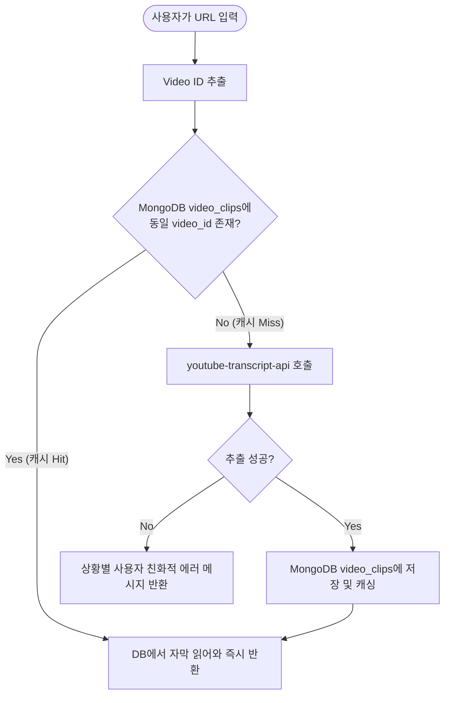

# 유튜브 자막 연동 기능 구현 계획서 (`youtube-transcript-api` 활용)

본 문서는 `youtube-transcript-api` 라이브러리의 특징을 분석하고, 이를 활용하여 유튜브 URL에서 자막을 추출하고 데이터베이스에 캐싱하는 기능의 구현 계획을 정리합니다.

---

## 1. `youtube-transcript-api` 핵심 요약

`youtube-transcript-api`는 별도의 YouTube API key 없이 작동하며, HTML 스크래핑 방식으로 자막을 빠르고 간단하게 가져올 수 있는 파이썬 라이브러리입니다.

### 1) 기본 사용법
* **단일 자막 획득:** `YouTubeTranscriptApi.get_transcript(video_id, languages=['ko', 'en'])`
* **자막 데이터 형식:** 리스트 내부 딕셔너리 구조
  ```python
  [
      {
          "text": "안녕하세요, 오늘 운동을 시작해보겠습니다.",
          "start": 0.54,      # 시작 시간 (초)
          "duration": 3.21    # 노출 시간 (초)
      },
      ...
  ]
  ```

### 2) 다국어 및 번역 지원
* **우선순위 언어 지정:** `languages=['ko', 'en']` 배열로 전달하여 한국어 자막이 없을 경우 영어 자막으로 폴백(Fallback) 지정이 가능합니다.
* **유튜브 자동 생성 자막:** 수동 작성 자막이 없을 경우, 유튜브가 인공지능으로 자동 생성한(auto-generated) 자막도 추출 가능합니다.

### 3) 예외 처리 (Exceptions)
공식 문서 기준, 안정적인 운영을 위해 아래 5가지 핵심 예외 상황에 대한 예외 처리가 필수적입니다.
* `TranscriptsDisabled`: 해당 영상에 자막 기능이 꺼져 있는 경우
* `NoTranscriptFound`: 요청한 언어(예: 한국어/영어)의 자막을 찾을 수 없는 경우
* `VideoUnavailable`: 비공개 영상이거나 국가 제한, 연령 제한 등으로 접근 불가능한 경우
* `TooManyRequests` / `RequestBlocked` / `IpBlocked`: 유튜브 측으로부터 다량의 요청으로 인해 IP가 차단되거나 지연이 발생한 경우 (상용 서버 배포 시 주의 필요)

---

## 2. AudioFit 기능 구현 상세 계획

### 1단계: 유튜브 URL에서 Video ID 추출 규칙 정의
사용자가 입력할 수 있는 다양한 유튜브 URL 패턴에서 `video_id` (11글자 고유값)를 안정적으로 추출합니다.
* **지원할 패턴:**
  * 기본형: `https://www.youtube.com/watch?v=dQw4w9WgXcQ`
  * 단축형: `https://youtu.be/dQw4w9WgXcQ`
  * 모바일/공유: `https://m.youtube.com/watch?v=dQw4w9WgXcQ`
  * 임베드형: `https://www.youtube.com/embed/dQw4w9WgXcQ`

### 2단계: 자막 캐싱 흐름 (DB 우선 조회)
유튜브 자막 스크래핑은 비용이 들고 IP 차단 위험이 있으므로, 데이터베이스(`video_clips`)를 먼저 조회하여 캐싱된 데이터가 있는지 확인하는 파이프라인을 구축합니다.



### 3단계: 백엔드 유틸리티 함수 구현 (`backend/apps/utils/youtube.py`)
유튜브 영상 자막 가져오기 및 URL 분석 작업을 전담할 모듈을 만듭니다.

```python
import re
from youtube_transcript_api import YouTubeTranscriptApi
from youtube_transcript_api._errors import TranscriptsDisabled, NoTranscriptFound, VideoUnavailable

def extract_video_id(url):
    """다양한 유튜브 URL 형식에서 11자리 video_id를 추출합니다."""
    pattern = r'(?:https?:\/\/)?(?:www\.|m\.)?(?:youtube\.com\/(?:[^\/\n\s]+\/\S+\/|(?:v|e(?:mbed)?)\/|\S*?[?&]v=)|youtu\.be\/)([a-zA-Z0-9_-]{11})'
    match = re.search(pattern, url)
    return match.group(1) if match else None

def fetch_youtube_transcript(video_id):
    """
    유튜브 자막을 가져오며, 예외 상황에 맞춰 에러 메시지를 가공합니다.
    우선순위 언어: 한국어('ko') -> 영어('en')
    """
    try:
        # 한국어 자막을 시도하고 없을 경우 영어 자막으로 폴백
        transcript_list = YouTubeTranscriptApi.get_transcript(video_id, languages=['ko', 'en'])
        return {
            "success": True,
            "data": transcript_list
        }
    except TranscriptsDisabled:
        return {"success": False, "error": "해당 유튜브 영상의 자막 기능이 비활성화되어 있습니다."}
    except NoTranscriptFound:
        return {"success": False, "error": "해당 영상에서 한국어 혹은 영어 자막을 찾을 수 없습니다."}
    except VideoUnavailable:
        return {"success": False, "error": "영상이 삭제되었거나 비공개 상태 또는 연령 제한이 걸려 있습니다."}
    except Exception as e:
        return {"success": False, "error": f"자막을 가져오는 도중 알 수 없는 오류가 발생했습니다: {str(e)}"}
```

### 4단계: API 엔드포인트 연동 (`POST /api/v1/clips/transcript`)
사용자가 프론트엔드에서 유튜브 링크를 올릴 때 작동할 API 컨트롤러를 구성합니다.

1. **Request Body:** `{ "youtube_url": "https://youtu.be/..." }`
2. **Logic:**
   * URL이 올바른 유튜브 링크인지 확인하고 `video_id` 추출.
   * MongoDB `video_clips`에 해당 `video_id` 자료가 있는지 검사.
   * 데이터가 없으면 `fetch_youtube_transcript` 함수를 호출하여 자막 다운로드 및 DB 저장.
3. **Response (성공):** 자막 배열 반환
4. **Response (실패):** `400 Bad Request` 와 함께 적절한 에러 안내문 반환

---

## 3. 예외 상황 대비 운영 방안 (Production Risk)

* **배포 환경 IP 차단 방지 (Render 등 Cloud 환경):**
  * Render 서버는 공용 데이터센터 IP를 공유하므로 YouTube 측으로부터 빈번한 `TooManyRequests` 차단을 당할 수 있습니다.
  * **해결책:** 상용 환경에서 빈번히 차단될 경우, 프록시 서버(`proxies` 인자)를 `YouTubeTranscriptApi.get_transcript(..., proxies=...)` 형태로 세팅할 수 있도록 준비해 둡니다.
